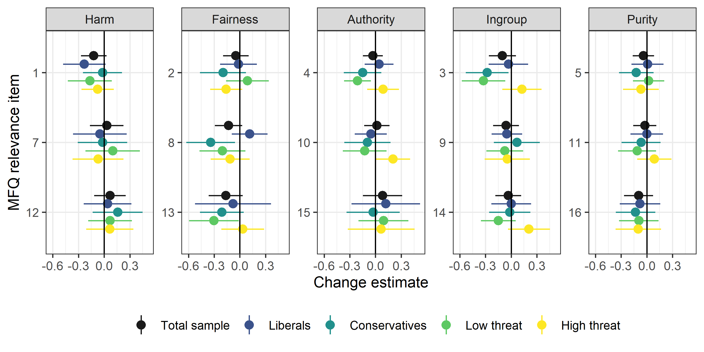

```r
# Create covid threat index.
mfq <- mfq %>% 
  mutate(cov = (cov_worry + cov_affect - cov_others_worry)/3, 
         cov_sc = scale(cov)[,1])
         
mfq <- mfq %>% 
  group_by(id) %>% 
  mutate(
    # Identify those who participated in wave two.
    particip_t2 = n() == 2,
    # Recode changed ideology as missing values. 
    polviews = ifelse(n_distinct(polviews) > 1, 
                      NA_character_, 
                      as.character(polviews)),
    polviews = factor(polviews, levels = c("liberal", "moderate", "conservative", "libertarian")),
    polviews = fct_relabel(polviews, ~paste0(str_to_sentence(.), "s"))
  ) %>%
  ungroup()

# Reshape to long format by items.
mfq_long_i <- mfq %>% 
  filter(particip_t2) %>% 
  select(id, wave, polviews, cov_sc, suffer:pure, cared:god) %>%
  pivot_longer(cols = suffer:god, 
               names_to = "mf_item", 
               values_to = "value") %>% 
  mutate(mf = fct_collapse(mf_item,
                           Harm = c("suffer", "cared", "cruel"),
                           Fairness = c("treatdiff", "unfair", "rights"),
                           Ingroup = c("country", "betray", "loyal"),
                           Authority = c("auth", "trad", "chaos"),
                           Purity = c("pure", "disgust", "god")
                           ),
         mf = fct_relevel(mf, "Harm", "Fairness"), 
         mf_item = fct_recode(mf_item, 
                              `1` = "suffer",
                              `2` = "treatdiff",
                              `3` = "country",
                              `4` = "auth",
                              `5` = "pure",
                              `7` = "cared",
                              `8` = "unfair",
                              `9` = "betray",
                              `10` = "trad",
                              `11` = "disgust",
                              `12` = "cruel",
                              `13` = "rights",
                              `14` = "loyal",
                              `15` = "chaos",
                              `16` = "god"),
         mf_item = factor(mf_item, levels = c(1:5, 7:16)), 
         polviews = fct_recode(polviews, NULL = "Libertarians")) %>% 
  # drop empty items from the short versions
  drop_na(value)


# Reshape wide by time and calculate change
mfq_time_i <- mfq_long_i %>% 
  pivot_wider(names_from = wave, values_from = value) %>% 
  mutate(change = t2 - t1) 
```


# Method

## Versions of the MFQ Used in the Study


```r
left_join(
  mfq %>% 
    filter(wave == "t1") %>% 
    group_by(version) %>% 
    summarise(Time = paste(min(date), max(date), sep = " - "), 
              N_time1 = n()),
  mfq %>% 
    filter(wave == "t2") %>% 
    group_by(version) %>% 
    summarise(N_time2 = n(), 
              N_covid = sum(!is.na(cov)))
) %>% 
  kbl(caption = "Table 1. Different versions of the MFQ questionnaire included in the study.") %>% 
  kable_classic()
```

<table class=" lightable-classic" style='font-family: "Arial Narrow", "Source Sans Pro", sans-serif; margin-left: auto; margin-right: auto;'>
<caption>Table 1. Different versions of the MFQ questionnaire included in the study.</caption>
 <thead>
  <tr>
   <th style="text-align:right;"> version </th>
   <th style="text-align:left;"> Time </th>
   <th style="text-align:right;"> N_time1 </th>
   <th style="text-align:right;"> N_time2 </th>
   <th style="text-align:right;"> N_covid </th>
  </tr>
 </thead>
<tbody>
  <tr>
   <td style="text-align:right;"> 1 </td>
   <td style="text-align:left;"> 2019-09-18 - 2019-09-19 </td>
   <td style="text-align:right;"> 99 </td>
   <td style="text-align:right;"> 73 </td>
   <td style="text-align:right;"> 73 </td>
  </tr>
  <tr>
   <td style="text-align:right;"> 2 </td>
   <td style="text-align:left;"> 2020-02-13 - 2020-02-13 </td>
   <td style="text-align:right;"> 35 </td>
   <td style="text-align:right;"> 22 </td>
   <td style="text-align:right;"> 14 </td>
  </tr>
  <tr>
   <td style="text-align:right;"> 3 </td>
   <td style="text-align:left;"> 2020-02-13 - 2020-02-13 </td>
   <td style="text-align:right;"> 28 </td>
   <td style="text-align:right;"> 20 </td>
   <td style="text-align:right;"> 16 </td>
  </tr>
  <tr>
   <td style="text-align:right;"> 4 </td>
   <td style="text-align:left;"> 2020-02-14 - 2020-02-15 </td>
   <td style="text-align:right;"> 28 </td>
   <td style="text-align:right;"> 23 </td>
   <td style="text-align:right;"> 15 </td>
  </tr>
  <tr>
   <td style="text-align:right;"> 5 </td>
   <td style="text-align:left;"> 2020-02-14 - 2020-02-14 </td>
   <td style="text-align:right;"> 32 </td>
   <td style="text-align:right;"> 19 </td>
   <td style="text-align:right;"> 11 </td>
  </tr>
  <tr>
   <td style="text-align:right;"> 6 </td>
   <td style="text-align:left;"> 2020-02-19 - 2020-02-20 </td>
   <td style="text-align:right;"> 28 </td>
   <td style="text-align:right;"> 24 </td>
   <td style="text-align:right;"> 20 </td>
  </tr>
  <tr>
   <td style="text-align:right;"> 7 </td>
   <td style="text-align:left;"> 2020-02-19 - 2020-02-21 </td>
   <td style="text-align:right;"> 30 </td>
   <td style="text-align:right;"> 19 </td>
   <td style="text-align:right;"> 14 </td>
  </tr>
  <tr>
   <td style="text-align:right;"> 8 </td>
   <td style="text-align:left;"> 2020-02-19 - 2020-02-20 </td>
   <td style="text-align:right;"> 28 </td>
   <td style="text-align:right;"> 19 </td>
   <td style="text-align:right;"> 19 </td>
  </tr>
  <tr>
   <td style="text-align:right;"> 9 </td>
   <td style="text-align:left;"> 2020-02-19 - 2020-02-21 </td>
   <td style="text-align:right;"> 24 </td>
   <td style="text-align:right;"> 18 </td>
   <td style="text-align:right;"> 15 </td>
  </tr>
</tbody>
</table>


## Sample


```r
count(mfq, wave)
```

```
## # A tibble: 2 x 2
##   wave      n
##   <chr> <int>
## 1 t1      332
## 2 t2      237
```


```r
mfq %>% 
  filter(particip_t2) %>% 
  summarise(women = mean(gender == "Female"),
            mean(age),
            sd(age), 
            Liberals = mean(polviews == "Liberals", na.rm = TRUE),
            Conservatives = mean(polviews == "Conservatives", na.rm = TRUE))
```

```
## # A tibble: 1 x 5
##   women `mean(age)` `sd(age)` Liberals Conservatives
##   <dbl>       <dbl>     <dbl>    <dbl>         <dbl>
## 1 0.454        42.2      11.2    0.543         0.335
```


## Measures


```r
covid19 <- mfq %>%
  filter(wave == "t2") %>% 
  select(cov_worry, cov_affect, cov_others_worry)

psych::alpha(covid19, check.keys = TRUE)$total$std.alpha
```

```
## [1] 0.8171348
```

The covid-19 related perceived threat alpha = `r `

# Results


```r
orig <- tribble(
~mf, ~alpha, ~total, ~Liberals, ~Moderates, ~Conservatives, ~Libertarians,
"Harm", .70, "3.77 (0.86)", "3.93 (0.76)", "3.68 (0.84)", "3.48 (0.89)", "3.26 (1.03)",
"Fairness", .65, "3.89 (0.78)", "4.04 (0.67)", "3.77 (0.77)", "3.44 (0.87)", "3.66 (0.90)",
"Ingroup", .71, "2.24 (1.03)", "2.06 (0.94)", "2.56 (1.00)", "3.03 (1.02)", "2.16 (1.10)",
"Authority", .67, "2.03 (0.95)", "1.88 (0.86)", "2.37 (0.90)", "2.81 (0.91)", "1.71 (0.95)",
"Purity", .68, "1.68 (1.11)", "1.44 (0.94)", "2.09 (1.09)", "2.88 (1.11)", "1.31 (1.03)"
)

orig <- orig %>% 
  select(mf, Liberals, Moderates, Conservatives) %>% 
  gather("polviews", "value", -mf) %>% 
  mutate(gr_mean = str_sub(value, 1, 4),
         gr_mean = as.numeric(gr_mean)) %>% 
  select(-value)

# aggregate by item and them by mf
mean_scores <- mfq_long_i %>% 
  filter(wave == "t1", !is.na(polviews)) %>% 
  group_by(mf, mf_item, polviews) %>% 
  summarise(mean = mean(value)) %>% 
  group_by(mf, polviews) %>% 
  summarise(mean = mean(mean)) 

# add graham data
mean_scores <- left_join(mean_scores, orig)

mean_scores %>% 
  mutate(comb = sprintf("%.2f (%.2f)", mean, gr_mean), 
         mf = factor(mf, levels = levels(mfq_long_i$mf))) %>% 
  select(mf, polviews, comb) %>% 
  spread(polviews, comb) %>% 
  select(mf, Liberals, Moderates, Conservatives) %>% 
  kbl(col.names = c("MF", "Liberals", "Moderates", "Conservatives"),
      caption = "Table 2. Mean relevance scores for different moral foundations among Liberalss, Moderatess, and Conservativess, with corresponding mean values from Graham et al. (2011) within parentheses.") %>%
  kable_classic()
```

<table class=" lightable-classic" style='font-family: "Arial Narrow", "Source Sans Pro", sans-serif; margin-left: auto; margin-right: auto;'>
<caption>Table 2. Mean relevance scores for different moral foundations among Liberalss, Moderatess, and Conservativess, with corresponding mean values from Graham et al. (2011) within parentheses.</caption>
 <thead>
  <tr>
   <th style="text-align:left;"> MF </th>
   <th style="text-align:left;"> Liberals </th>
   <th style="text-align:left;"> Moderates </th>
   <th style="text-align:left;"> Conservatives </th>
  </tr>
 </thead>
<tbody>
  <tr>
   <td style="text-align:left;"> Harm </td>
   <td style="text-align:left;"> 4.00 (3.93) </td>
   <td style="text-align:left;"> 3.56 (3.68) </td>
   <td style="text-align:left;"> 3.44 (3.48) </td>
  </tr>
  <tr>
   <td style="text-align:left;"> Fairness </td>
   <td style="text-align:left;"> 4.08 (4.04) </td>
   <td style="text-align:left;"> 3.87 (3.77) </td>
   <td style="text-align:left;"> 3.79 (3.44) </td>
  </tr>
  <tr>
   <td style="text-align:left;"> Authority </td>
   <td style="text-align:left;"> 2.10 (1.88) </td>
   <td style="text-align:left;"> 2.38 (2.37) </td>
   <td style="text-align:left;"> 2.82 (2.81) </td>
  </tr>
  <tr>
   <td style="text-align:left;"> Ingroup </td>
   <td style="text-align:left;"> 1.85 (2.06) </td>
   <td style="text-align:left;"> 2.45 (2.56) </td>
   <td style="text-align:left;"> 2.41 (3.03) </td>
  </tr>
  <tr>
   <td style="text-align:left;"> Purity </td>
   <td style="text-align:left;"> 1.60 (1.44) </td>
   <td style="text-align:left;"> 2.30 (2.09) </td>
   <td style="text-align:left;"> 2.68 (2.88) </td>
  </tr>
</tbody>
</table>

## Attrition


```r
mfq_drp <- mfq %>%
  filter(wave == "t1") %>% 
  select(particip_t2, 
         suffer, cared, cruel,
         treatdiff, unfair, rights,
         country, betray, loyal,
         auth, trad, chaos,
         pure, disgust, god) %>% 
  gather(mf_item, value, suffer:god)

drp_res <- mfq_drp %>% 
  group_by(mf_item) %>% 
  summarise(t.test(value ~ particip_t2) %>% 
                               tidy()) 

drp_res %>% 
  summarise(min(p.value))
```

```
## # A tibble: 1 x 1
##   `min(p.value)`
##            <dbl>
## 1          0.111
```


## Change in Endorsement of Moral Foundations


```r
full_sample <- mfq_time_i %>% 
  group_by(mf, mf_item) %>% 
  summarise(n = n(),
            t.test(change) %>% tidy(conf.int = TRUE),
            d = estimate/sqrt((var(t1) + var(t2))/2)) %>% 
  ungroup() %>% 
  mutate(gr = "Total sample")


eff_by_polv <- mfq_time_i %>% 
  filter(polviews %in% c("Liberals", "Conservatives")) %>% 
  group_by(mf, mf_item, polviews) %>% 
  summarise(n = n(),
            t.test(change) %>% tidy(conf.int = TRUE),
            d = estimate/sqrt((var(t1) + var(t2))/2)) %>% 
  ungroup() %>% 
  rename(gr = polviews)

eff_by_thr <- mfq_time_i %>% 
  drop_na(cov_sc) %>% 
  mutate(cov_worry = cut(cov_sc, 
                         c(-Inf, median(cov_sc), Inf),
                         labels = c("Low threat",
                                    "High threat"))) %>% 
  group_by(mf, mf_item, cov_worry) %>% 
  summarise(n = n(),
            t.test(change) %>% tidy(conf.int = TRUE),
            d = estimate/sqrt((var(t1) + var(t2))/2)) %>% 
  ungroup() %>% 
  rename(gr = cov_worry)

comb_change_est <- bind_rows(
  full_sample, 
  eff_by_polv,
  eff_by_thr 
) %>% 
  mutate(gr = factor(gr, levels = unique(gr)), 
         d = sprintf("%.2f", d), 
         n = sprintf("%.0f", n))

out_table <- comb_change_est %>% 
  select(mf, mf_item, gr, d, n) %>% 
  pivot_wider(
    names_from = gr,
    values_from = c(d, n),
    names_glue = "{gr}_{.value}"
  ) %>% 
  select(mf, mf_item, starts_with("Total"), 
         starts_with("Cons"), starts_with("Lib"),
         starts_with("Low"), starts_with("High")) 

out_table %>% 
  kbl(col.names = c("MF", "Item", rep(c("d", "n"), 5)), 
      caption = "Table 3. Mean difference (d) in standardized relevance scores between the first and second wave (negative values signifies a decrease in relevance).") %>%
  collapse_rows(columns = 1, valign = "top") %>% 
  add_header_above(c(
    " " = 1, " " = 1, "Total sample" = 2, 
    "Conserv." = 2, "Liberals" = 2,
    "Low threat" = 2, "High threat" = 2
    )) %>% 
  kable_classic() 
```

<table class=" lightable-classic" style='font-family: "Arial Narrow", "Source Sans Pro", sans-serif; margin-left: auto; margin-right: auto;'>
<caption>Table 3. Mean difference (d) in standardized relevance scores between the first and second wave (negative values signifies a decrease in relevance).</caption>
 <thead>
<tr>
<th style="empty-cells: hide;border-bottom:hidden;" colspan="1"></th>
<th style="empty-cells: hide;border-bottom:hidden;" colspan="1"></th>
<th style="border-bottom:hidden;padding-bottom:0; padding-left:3px;padding-right:3px;text-align: center; " colspan="2"><div style="border-bottom: 1px solid #ddd; padding-bottom: 5px; ">Total sample</div></th>
<th style="border-bottom:hidden;padding-bottom:0; padding-left:3px;padding-right:3px;text-align: center; " colspan="2"><div style="border-bottom: 1px solid #ddd; padding-bottom: 5px; ">Conserv.</div></th>
<th style="border-bottom:hidden;padding-bottom:0; padding-left:3px;padding-right:3px;text-align: center; " colspan="2"><div style="border-bottom: 1px solid #ddd; padding-bottom: 5px; ">Liberals</div></th>
<th style="border-bottom:hidden;padding-bottom:0; padding-left:3px;padding-right:3px;text-align: center; " colspan="2"><div style="border-bottom: 1px solid #ddd; padding-bottom: 5px; ">Low threat</div></th>
<th style="border-bottom:hidden;padding-bottom:0; padding-left:3px;padding-right:3px;text-align: center; " colspan="2"><div style="border-bottom: 1px solid #ddd; padding-bottom: 5px; ">High threat</div></th>
</tr>
  <tr>
   <th style="text-align:left;"> MF </th>
   <th style="text-align:left;"> Item </th>
   <th style="text-align:left;"> d </th>
   <th style="text-align:left;"> n </th>
   <th style="text-align:left;"> d </th>
   <th style="text-align:left;"> n </th>
   <th style="text-align:left;"> d </th>
   <th style="text-align:left;"> n </th>
   <th style="text-align:left;"> d </th>
   <th style="text-align:left;"> n </th>
   <th style="text-align:left;"> d </th>
   <th style="text-align:left;"> n </th>
  </tr>
 </thead>
<tbody>
  <tr>
   <td style="text-align:left;vertical-align: top !important;" rowspan="3"> Harm </td>
   <td style="text-align:left;"> 1 </td>
   <td style="text-align:left;"> -0.10 </td>
   <td style="text-align:left;"> 148 </td>
   <td style="text-align:left;"> -0.01 </td>
   <td style="text-align:left;"> 54 </td>
   <td style="text-align:left;"> -0.21 </td>
   <td style="text-align:left;"> 69 </td>
   <td style="text-align:left;"> -0.12 </td>
   <td style="text-align:left;"> 66 </td>
   <td style="text-align:left;"> -0.08 </td>
   <td style="text-align:left;"> 66 </td>
  </tr>
  <tr>
   
   <td style="text-align:left;"> 7 </td>
   <td style="text-align:left;"> 0.02 </td>
   <td style="text-align:left;"> 132 </td>
   <td style="text-align:left;"> -0.01 </td>
   <td style="text-align:left;"> 52 </td>
   <td style="text-align:left;"> -0.04 </td>
   <td style="text-align:left;"> 60 </td>
   <td style="text-align:left;"> 0.07 </td>
   <td style="text-align:left;"> 60 </td>
   <td style="text-align:left;"> -0.06 </td>
   <td style="text-align:left;"> 56 </td>
  </tr>
  <tr>
   
   <td style="text-align:left;"> 12 </td>
   <td style="text-align:left;"> 0.07 </td>
   <td style="text-align:left;"> 73 </td>
   <td style="text-align:left;"> 0.14 </td>
   <td style="text-align:left;"> 38 </td>
   <td style="text-align:left;"> 0.05 </td>
   <td style="text-align:left;"> 25 </td>
   <td style="text-align:left;"> 0.06 </td>
   <td style="text-align:left;"> 43 </td>
   <td style="text-align:left;"> 0.09 </td>
   <td style="text-align:left;"> 30 </td>
  </tr>
  <tr>
   <td style="text-align:left;vertical-align: top !important;" rowspan="3"> Fairness </td>
   <td style="text-align:left;"> 2 </td>
   <td style="text-align:left;"> -0.04 </td>
   <td style="text-align:left;"> 151 </td>
   <td style="text-align:left;"> -0.15 </td>
   <td style="text-align:left;"> 56 </td>
   <td style="text-align:left;"> -0.01 </td>
   <td style="text-align:left;"> 68 </td>
   <td style="text-align:left;"> 0.07 </td>
   <td style="text-align:left;"> 67 </td>
   <td style="text-align:left;"> -0.15 </td>
   <td style="text-align:left;"> 69 </td>
  </tr>
  <tr>
   
   <td style="text-align:left;"> 8 </td>
   <td style="text-align:left;"> -0.12 </td>
   <td style="text-align:left;"> 129 </td>
   <td style="text-align:left;"> -0.26 </td>
   <td style="text-align:left;"> 50 </td>
   <td style="text-align:left;"> 0.12 </td>
   <td style="text-align:left;"> 61 </td>
   <td style="text-align:left;"> -0.16 </td>
   <td style="text-align:left;"> 59 </td>
   <td style="text-align:left;"> -0.12 </td>
   <td style="text-align:left;"> 53 </td>
  </tr>
  <tr>
   
   <td style="text-align:left;"> 13 </td>
   <td style="text-align:left;"> -0.15 </td>
   <td style="text-align:left;"> 73 </td>
   <td style="text-align:left;"> -0.18 </td>
   <td style="text-align:left;"> 38 </td>
   <td style="text-align:left;"> -0.08 </td>
   <td style="text-align:left;"> 25 </td>
   <td style="text-align:left;"> -0.28 </td>
   <td style="text-align:left;"> 43 </td>
   <td style="text-align:left;"> 0.03 </td>
   <td style="text-align:left;"> 30 </td>
  </tr>
  <tr>
   <td style="text-align:left;vertical-align: top !important;" rowspan="3"> Authority </td>
   <td style="text-align:left;"> 4 </td>
   <td style="text-align:left;"> -0.02 </td>
   <td style="text-align:left;"> 227 </td>
   <td style="text-align:left;"> -0.11 </td>
   <td style="text-align:left;"> 73 </td>
   <td style="text-align:left;"> 0.03 </td>
   <td style="text-align:left;"> 116 </td>
   <td style="text-align:left;"> -0.15 </td>
   <td style="text-align:left;"> 100 </td>
   <td style="text-align:left;"> 0.06 </td>
   <td style="text-align:left;"> 90 </td>
  </tr>
  <tr>
   
   <td style="text-align:left;"> 10 </td>
   <td style="text-align:left;"> 0.01 </td>
   <td style="text-align:left;"> 187 </td>
   <td style="text-align:left;"> -0.06 </td>
   <td style="text-align:left;"> 64 </td>
   <td style="text-align:left;"> -0.05 </td>
   <td style="text-align:left;"> 91 </td>
   <td style="text-align:left;"> -0.09 </td>
   <td style="text-align:left;"> 87 </td>
   <td style="text-align:left;"> 0.16 </td>
   <td style="text-align:left;"> 68 </td>
  </tr>
  <tr>
   
   <td style="text-align:left;"> 15 </td>
   <td style="text-align:left;"> 0.07 </td>
   <td style="text-align:left;"> 73 </td>
   <td style="text-align:left;"> -0.02 </td>
   <td style="text-align:left;"> 38 </td>
   <td style="text-align:left;"> 0.09 </td>
   <td style="text-align:left;"> 25 </td>
   <td style="text-align:left;"> 0.08 </td>
   <td style="text-align:left;"> 43 </td>
   <td style="text-align:left;"> 0.05 </td>
   <td style="text-align:left;"> 30 </td>
  </tr>
  <tr>
   <td style="text-align:left;vertical-align: top !important;" rowspan="3"> Ingroup </td>
   <td style="text-align:left;"> 3 </td>
   <td style="text-align:left;"> -0.08 </td>
   <td style="text-align:left;"> 127 </td>
   <td style="text-align:left;"> -0.21 </td>
   <td style="text-align:left;"> 50 </td>
   <td style="text-align:left;"> -0.03 </td>
   <td style="text-align:left;"> 62 </td>
   <td style="text-align:left;"> -0.24 </td>
   <td style="text-align:left;"> 62 </td>
   <td style="text-align:left;"> 0.09 </td>
   <td style="text-align:left;"> 48 </td>
  </tr>
  <tr>
   
   <td style="text-align:left;"> 9 </td>
   <td style="text-align:left;"> -0.05 </td>
   <td style="text-align:left;"> 169 </td>
   <td style="text-align:left;"> 0.05 </td>
   <td style="text-align:left;"> 60 </td>
   <td style="text-align:left;"> -0.04 </td>
   <td style="text-align:left;"> 79 </td>
   <td style="text-align:left;"> -0.06 </td>
   <td style="text-align:left;"> 80 </td>
   <td style="text-align:left;"> -0.04 </td>
   <td style="text-align:left;"> 65 </td>
  </tr>
  <tr>
   
   <td style="text-align:left;"> 14 </td>
   <td style="text-align:left;"> -0.03 </td>
   <td style="text-align:left;"> 172 </td>
   <td style="text-align:left;"> -0.01 </td>
   <td style="text-align:left;"> 61 </td>
   <td style="text-align:left;"> 0.00 </td>
   <td style="text-align:left;"> 79 </td>
   <td style="text-align:left;"> -0.11 </td>
   <td style="text-align:left;"> 80 </td>
   <td style="text-align:left;"> 0.17 </td>
   <td style="text-align:left;"> 72 </td>
  </tr>
  <tr>
   <td style="text-align:left;vertical-align: top !important;" rowspan="3"> Purity </td>
   <td style="text-align:left;"> 5 </td>
   <td style="text-align:left;"> -0.03 </td>
   <td style="text-align:left;"> 224 </td>
   <td style="text-align:left;"> -0.08 </td>
   <td style="text-align:left;"> 73 </td>
   <td style="text-align:left;"> 0.01 </td>
   <td style="text-align:left;"> 112 </td>
   <td style="text-align:left;"> 0.01 </td>
   <td style="text-align:left;"> 100 </td>
   <td style="text-align:left;"> -0.04 </td>
   <td style="text-align:left;"> 87 </td>
  </tr>
  <tr>
   
   <td style="text-align:left;"> 11 </td>
   <td style="text-align:left;"> -0.02 </td>
   <td style="text-align:left;"> 171 </td>
   <td style="text-align:left;"> -0.04 </td>
   <td style="text-align:left;"> 60 </td>
   <td style="text-align:left;"> 0.00 </td>
   <td style="text-align:left;"> 83 </td>
   <td style="text-align:left;"> -0.08 </td>
   <td style="text-align:left;"> 79 </td>
   <td style="text-align:left;"> 0.06 </td>
   <td style="text-align:left;"> 68 </td>
  </tr>
  <tr>
   
   <td style="text-align:left;"> 16 </td>
   <td style="text-align:left;"> -0.05 </td>
   <td style="text-align:left;"> 73 </td>
   <td style="text-align:left;"> -0.06 </td>
   <td style="text-align:left;"> 38 </td>
   <td style="text-align:left;"> -0.04 </td>
   <td style="text-align:left;"> 25 </td>
   <td style="text-align:left;"> -0.04 </td>
   <td style="text-align:left;"> 43 </td>
   <td style="text-align:left;"> -0.05 </td>
   <td style="text-align:left;"> 30 </td>
  </tr>
</tbody>
</table>


```r
# Use viridis colour scheme, but replace the darkest with grey10 for full sample
colours <- scales::viridis_pal(direction = -1)(5)
colours <- c(colours[1:4], "grey10")

comb_change_est %>% 
  ggplot(aes(fct_rev(mf_item), estimate, 
             ymin = conf.low, ymax = conf.high, 
             color = fct_rev(gr))) +
  geom_pointrange(position = position_dodge(width = .6)) +
  geom_hline(yintercept = 0) +
  labs(y = "Change estimate", x = "MFQ relevance item", color = NULL) +
  coord_flip() +
  theme_bw(base_size = 11) +
  facet_wrap(~ mf, scales = "free_y", ncol = 5) +
  scale_colour_manual(values = colours) +
  theme(legend.position = "bottom",
        axis.text.x = element_text(size = 9)) +
  guides(color = guide_legend(reverse = TRUE))
```



```r
# ggsave("fig1_mean-change.jpeg", width = 180, height = 90, units = "mm")
```

